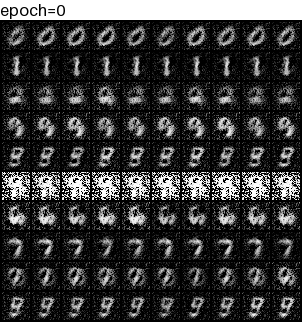

# CGAN
## datasets
- [x] MNIST
- [ ] FashionMNIST
- [ ] CIFAR10
- [ ] CIFAR100

## experiments
### MNIST
```shell
python main.py fit -c exps/cgan/configs/mnist.yaml
```

### FashionMNIST
```shell
python main.py fit -c exps/cgan/configs/fashionmnist.yaml
```
