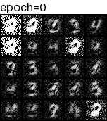
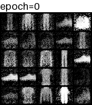

# GAN
## datasets
- [x] MNIST
- [x] FashionMNIST
- [ ] CIFAR10
- [ ] CIFAR100
## experiments
### MNIST
```shell
python main.py fit -c exps/gan/configs/mnist.yaml
```

### FashionMNIST
```shell
python main.py fit -c exps/gan/configs/fashionmnist.yaml
```
