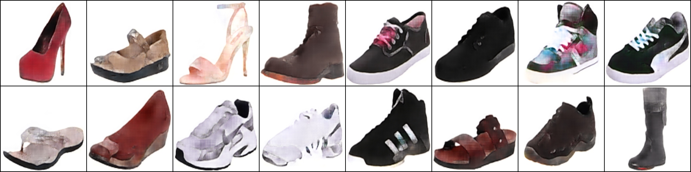

# Pix2Pix
## [datasets](https://efrosgans.eecs.berkeley.edu/pix2pix/datasets/)
- [ ] cityscapes
- [ ] edges2handbags 
- [x] edges2shoes 
- [x] facades
- [ ] maps 
- [ ] night2day	 
## experiments
### edges2shoes
```shell
python main.py fit -c exps/pix2pix/configs/edges2shoes.yaml
```
input image:

input generation:

output generation:

### facades
```shell
python main.py fit -c exps/pix2pix/configs/facades.yaml
```
input image:

input generation:

output generation:

