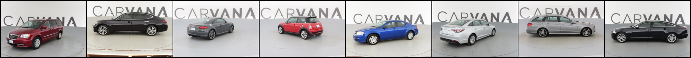
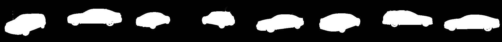
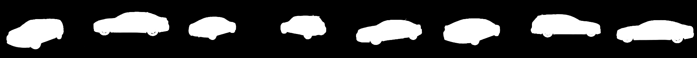

# Unet
## datasets
- [x] [Carvana](https://www.kaggle.com/c/carvana-image-masking-challenge/overview)
- [ ] [Pascal-VOC](http://host.robots.ox.ac.uk/pascal/VOC/) 
- [ ] [CUB-200-2011](https://www.vision.caltech.edu/datasets/cub_200_2011/)

## experiments
### Carvana
```shell
pytorchlab fit -c exps/unet/configs/carvana.yaml
```
input image example:

input mask example:

output mask example:

| epoch |  IOU   |  Dice  |
| :---: | :----: | :----: |
|  20   | 0.9893 | 0.9946 |